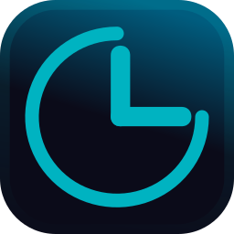

# Decibel



Automação Inteligente de Volume para Windows

Agende o volume do seu sistema. Acorde suave, trabalhe focado e jogue sem estourar os ouvidos.

<br>

<p align="center">
  <a href="https://github.com/Joao-VCorreia/Decibel/releases">
    
  </a>
  
  
  <a href="LICENSE.md">
    
  </a>
</p>

---

## Demonstração

| Funcionalidade | Preview |
| :--- | :--- |
| **Criação de Agendamentos**<br>Define horários e dias da semana para o volume mudar. | <video src="https://github.com/user-attachments/assets/63bf808b-e124-4fad-9425-98a772048c86" controls width="50%"></video> |
| **Operação**<br>Permite minimizar aplicação sem encerramento do monitoramento | <video src="https://github.com/user-attachments/assets/d3c26519-a65a-4226-aede-4acd74e209da" controls width="50%"></video> |
| **Recuperação**<br>Desfaz alterações acidentais (Undo). | <video src="https://github.com/user-attachments/assets/d9d4d467-2772-4ace-a723-cad89190c355" controls width="50%"></video> |

---
## Visão Geral

O **Decibel** é uma aplicação desktop desenvolvida para resolver um problema comum: o gerenciamento manual e repetitivo do volume do Windows. Ele permite criar "Planos de Volume" baseados em horários e dias da semana.

Seja para garantir que o PC não grite de madrugada ou para preparar o ambiente de trabalho pela manhã, o Decibel faz o ajuste automaticamente e de forma gradual (fade-in/fade-out).

### Por que usar o Decibel?

| Funcionalidade | Decibel 🎧 | Controle Manual básico |
| :--- | :---: | :---: |
| **Automação** | ✅ Ajuste automático por horário | ❌ Você precisa lembrar de mudar |
| **Transição** | ✅ Suave (Fade gradual) | ❌ Brusca (Pula de 10% para 100%) |
| **Organização** | ✅ Múltiplos Planos (Jogos, Trabalho) | ❌ Configuração única |
| **Privacidade** | ✅ 100% Local e Open Source | ❓ Softwares proprietários |

---

## Tecnologias e Arquitetura


* **Linguagem:** C# (.NET 8)
* **Framework UI:** WPF (Windows Presentation Foundation)
* **Áudio:** Manipulação de baixo nível com `NAudio`.
* **Persistência:** JSON (System.Text.Json) com Service Layer.

---

## Instalação e Uso

### Opção 1: Usuário Final

Baixe a versão mais recente pronta para uso:

1.  Acesse a aba [Releases](https://github.com/Joao-VCorreia/Decibel/releases).
2.  Baixe o arquivo `Decibel_Setup.zip`.
3.  Execute e aproveite!

### Opção 2: Desenvolvedor (Build from Source)

```bash
# Clone o repositório
git clone [https://github.com/SEU_USUARIO/Decibel.git](https://github.com/Joao-VCorreia/Decibel.git)

# Entre na pasta
cd Decibel

# Abra a solução 'Decibel.sln' no Visual Studio 2022
# Restaure os pacotes NuGet e compile (F5)
```

---

## Contribuição

Contribuições são bem-vindas! Se você tem uma ideia de funcionalidade ou encontrou um bug:

1. Faça um Fork do projeto.
2. Crie uma Branch para sua Feature
3. Faça o Commit
4. Faça o Push
5. Abra um Pull Request.

---

## Licença

Este projeto está sob a licença MIT. Veja o arquivo [LICENSE](LICENSE.md) para mais detalhes.
